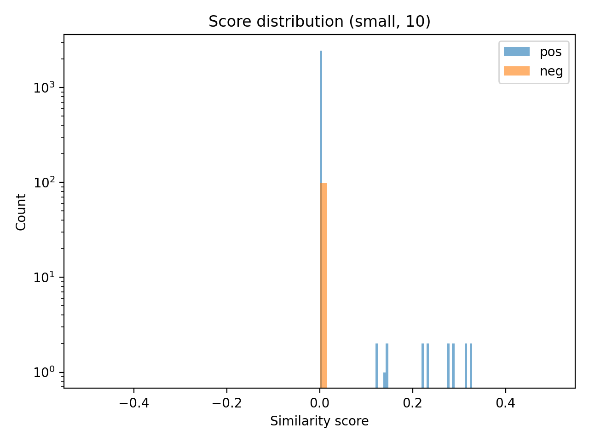
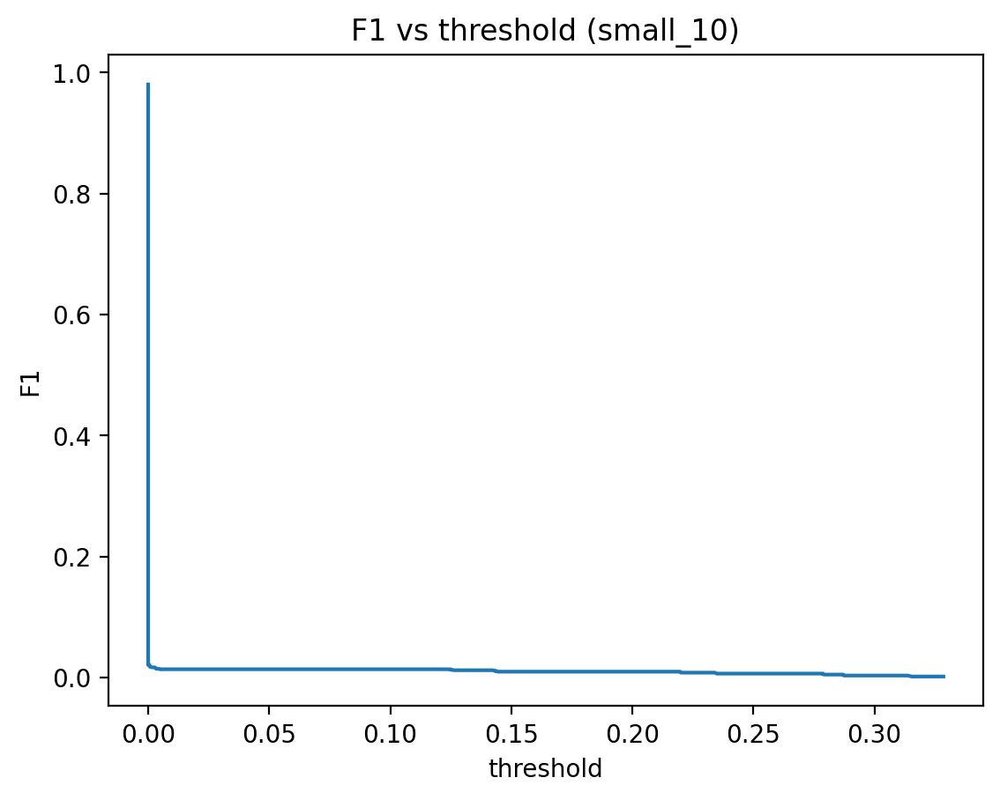
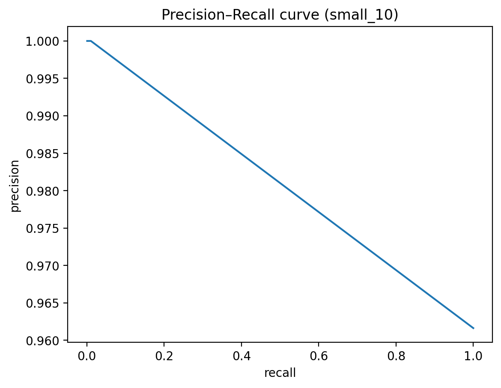

# Assignment 3 — DIRT: Extraction of Lexico-syntactic Similarities

## Analysis Report (Small = 10 files; Medium/Large placeholders)

## 1. Experimental Setup

### 1.1 Runs

We ran the system on:

* **Small**: 10 Biarcs files
* **Medium (placeholder)**: 20 Biarcs files (**10 original + 10 additional distributed across the lexicographic file index range**)
* **Large (placeholder)**: 100 files (budget permitting; or report the exact number used)

### 1.2 Outputs

For each run we produce:

* `mi.tsv` — MI feature table (`predicate \t slot \t filler \t mi`)
* `out_scores.tsv` — similarity per test pair (`label \t p1 \t p2 \t score`)

### 1.3 Evaluation Protocol

Each row in `out_scores.tsv` is labeled:

* `pos` = entailment (positive pair)
* `neg` = non-entailment (negative pair)

We define a classifier by thresholding:

* predict **pos** if `score >= threshold`, else **neg**

We report:

* Precision, Recall, F1
* Precision–Recall curve
* Error analysis examples (TP/FP/TN/FN)

---

## 2. Small Run (10 Files)

### 2.1 Basic Counts

* Positive pairs: **2481**
* Negative pairs: **99**
* Total pairs: **2580**

### 2.2 Score Distribution (Describe + Figure)

Observations:

* % of scores that are 0.0: **98.99%** (2554 / 2580)
* % of positive pairs with score > 0: **1.05%** (26 / 2481)
* % of negative pairs with score > 0: **0.00%** (0 / 99)

Insert figure (generated by your script):

Interpretation:

* The 10-file corpus yields very sparse feature overlap. Most test-pair similarities are exactly 0 because at least one predicate is missing from the corpus or because the two predicates do not share MI-weighted fillers in either slot.
* Negative pairs receiving all-zero scores in the small run is expected under high sparsity; this typically changes as corpus size increases and feature overlap becomes more frequent.

---

### 2.3 Choosing a Threshold and F1

We convert similarity scores into a binary decision using a threshold:

* Predict **POSITIVE** if `score >= threshold`
* Predict **NEGATIVE** otherwise

Because the small corpus (10 files) often produces many zero scores, the “best” threshold by F1 may be dominated by class imbalance. Therefore, we report two evaluations:

1. Best threshold according to a threshold sweep (maximize F1).
2. A diagnostic threshold slightly above 0 (treat score=0 as negative), which exposes sparsity-driven false negatives.

#### 2.3.1 Best Threshold by F1 Sweep (Small – 10 Files)

* Best threshold (max F1) = **0.0**

Confusion matrix at this threshold:

* TP = **2481**
* FP = **99**
* TN = **0**
* FN = **0**

Metrics:

* Precision = **0.9616**
* Recall = **1.0000**
* F1 = **0.9804**

Interpretation:

* The sweep selects threshold = 0.0, which predicts “positive” for all pairs. This can yield a high F1 because the dataset is heavily imbalanced toward positives, but it does not demonstrate meaningful separation between positive and negative pairs.

#### 2.3.2 Diagnostic Threshold: Score Must Be > 0 (Small – 10 Files)

We also evaluate a strict threshold:

* threshold = **1e-9** (equivalent to “score > 0”)

Confusion matrix at threshold 1e-9:

* TP = **26**
* FP = **0**
* TN = **99**
* FN = **2455**

Metrics:

* Precision = **1.0000**
* Recall = **0.0105**
* F1 = **0.0207**

Interpretation:

* With 10 files, most true entailment pairs still score 0, so recall collapses once we require a strictly positive similarity.
* For larger input sizes (20 files, 100 files), we expect more overlaps and therefore higher recall at meaningful thresholds, but also potentially more false positives due to increased chance of spurious overlap.

Insert figure (generated by your script):

---

## 3. Precision–Recall Curve

We evaluate ranking quality by sweeping the decision threshold over observed similarity scores and computing precision and recall at each threshold. This yields a Precision–Recall (PR) curve, where:

* Recall is on the x-axis
* Precision is on the y-axis

### 3.1 PR Curve (Small – 10 Files)

Computed summary:

* Number of distinct thresholds evaluated = **20**
* Average precision (optional) = **0.9710**

Observed behavior in sparse runs (10 files):

* At threshold = 0.0, recall is 1.0 because all pairs are predicted positive; precision equals the base positive rate.
* For threshold > 0, predicted positives drop sharply; precision increases but recall remains extremely low.

Insert figure (generated by your script):

### 3.2 PR Curve Placeholders for Medium and Large

**Medium (20 files; placeholder)**

* Input: 10 original + 10 additional distributed across lexicographic index range
* PR curve path: `figures/pr_curve_medium_20.png`
* Key observations (fill after run): ____________________________

**Large (100 files; placeholder)**

* Input size used: ________ (state exact number if < 100)
* PR curve path: `figures/pr_curve_large_100.png`
* Key observations (fill after run): ____________________________

---

## 4. Error Analysis

We categorize test pairs into TP/FP/TN/FN using a selected threshold. Because threshold = 0.0 produces no true negatives or false negatives, we use the diagnostic threshold (score > 0) for informative error categories.

### 4.1 Threshold Used for Error Categorization

We use:

* threshold = **1e-9** (i.e., score must be strictly greater than 0)

Rationale:

* With threshold=0.0, nearly all pairs become positive; there are no TN/FN to analyze.
* With threshold > 0, we can inspect which pairs achieved non-zero similarity and which remained at 0 due to sparsity.

### 4.2 Category Counts (Small – 10 Files)

* TP count = **26**
* FP count = **0**
* TN count = **99**
* FN count = **2455**

### 4.3 Examples (Small – 10 Files)

#### 4.3.1 True Positives (5 Examples; highest scores)

1. (pos) p1 = `X cover with Y` ; p2 = `X embellish with Y` ; score = **0.7902259261078707**
2. (pos) p1 = `X splatter with Y` ; p2 = `X cover with Y` ; score = **0.7752684946475381**
3. (pos) p1 = `X splash with Y` ; p2 = `X cover with Y` ; score = **0.7752684946475381**
4. (pos) p1 = `X cover with Y` ; p2 = `X rub with Y` ; score = **0.7527167664045418**
5. (pos) p1 = `X cover with Y` ; p2 = `X coat with Y` ; score = **0.7377912596350178**

#### 4.3.2 False Positives

* FP count = **0**
* No false positives observed at threshold > 0 in the 10-file run.
* Note: This may change in medium/large runs once negative pairs start receiving non-zero similarity due to increased overlap.

#### 4.3.3 True Negatives (5 Examples; all score 0.0)

1. (neg) p1 = `X expos to Y` ; p2 = `X protect from Y` ; score = **0.0**
2. (neg) p1 = `X differ from Y` ; p2 = `Y resembl X` ; score = **0.0**
3. (neg) p1 = `X distinguish from Y` ; p2 = `Y associ with X` ; score = **0.0**
4. (neg) p1 = `X know as Y` ; p2 = `X resembl Y` ; score = **0.0**
5. (neg) p1 = `X protect from Y` ; p2 = `X expos to Y` ; score = **0.0**

#### 4.3.4 False Negatives (5 Examples; positives with score 0.0)

1. (pos) p1 = `X abolish Y` ; p2 = `X abandon Y` ; score = **0.0**
2. (pos) p1 = `X abolish Y` ; p2 = `X outlaw Y` ; score = **0.0**
3. (pos) p1 = `X abolish Y` ; p2 = `X repeal Y` ; score = **0.0**
4. (pos) p1 = `X abolish Y` ; p2 = `X curb Y` ; score = **0.0**
5. (pos) p1 = `X abolish Y` ; p2 = `X bar Y` ; score = **0.0**

### 4.4 Comparing Small vs Larger Inputs (Placeholders)

Example A: p1=__________ p2=__________

* score(10) = ________
* score(20) = ________
* score(100) = ________
  Observation: ____________________________

Example B: p1=__________ p2=__________

* score(10) = ________
* score(20) = ________
* score(100) = ________
  Observation: ____________________________

### 4.5 Common Errors and Behaviors (Small – 10 Files)

Typical causes in small corpora:

* Missing predicate coverage: one or both predicates never appear in the 10 files.
* Feature sparsity: predicate exists but has few MI-weighted fillers; overlap is empty → score 0.
* Constraints (verb head, noun slots, inclusion of specific POS) reduce the number of extracted paths, which can further reduce recall on small input.
* Auxiliary filtering improves predicate quality but reduces coverage further in a small sample.

Expected changes in larger runs:

* More predicates and fillers appear → more non-zero similarities and improved recall at meaningful thresholds.
* Negatives may also gain non-zero scores → precision may drop and false positives may appear, making PR curve tradeoffs informative.

---

## 5. Medium/Large Run Sections (Placeholders)

### 5.1 Medium Run (20 Files: 10 Original + 10 Distributed Indices)

Input:

* 10 original files: ____________________
* Additional 10 files (distributed across lexicographic index range): ____________________
  (Strategy: select files from spaced index buckets to increase lexical diversity and reduce sampling bias.)

Fill after running:

* Positive pairs: ________
* Negative pairs: ________
* Total pairs: ________
* % scores == 0: ________
* Best threshold (max F1): ________
* F1 at best threshold: ________
* Diagnostic threshold (1e-9) F1: ________
* PR curve path: `figures/pr_curve_medium_20.png`
* Short observation: ____________________________

### 5.2 Large Run (100 Files) Placeholder

Fill after running:

* Input size used: ________
* Best threshold (max F1): ________
* F1 at best threshold: ________
* PR curve path: `figures/pr_curve_large_100.png`
* Short observation: ____________________________

---

## 6. Summary and Next Steps

### 6.1 Summary of Small Run (10 Files)

* Best-F1 threshold (from sweep): **0.0**
* F1 at best threshold: **0.9804**
* Diagnostic threshold (score > 0) F1: **0.0207**
* Key behavior: **highly sparse scores (almost all 0.0); meaningful separation not yet achieved on 10 files**

### 6.2 Next Steps

1. Run Medium (20 files):

   * Execute MapReduce on 10 original + 10 distributed additional files.
   * Merge reducer outputs to `mi.tsv (20)`.
   * Run local evaluation to produce `out_scores.tsv (20)`.
2. Recompute:

   * F1 vs threshold and best threshold.
   * PR curve.
   * Error analysis (TP/FP/TN/FN) and compare to small.
3. If budget allows, run Large:

   * Repeat the same evaluation and emphasize differences in sparsity, threshold stability, and emergence of false positives.

### 6.3 Expected Differences Between 10, 20, and 100 Files

* Coverage increases with corpus size (more test predicates appear).
* Score distribution becomes less degenerate (more non-zero similarities).
* Threshold selection becomes more meaningful (best threshold may shift away from 0.0).
* False positives may increase as unrelated predicates share fillers more often; PR curve highlights precision/recall tradeoffs.

---

